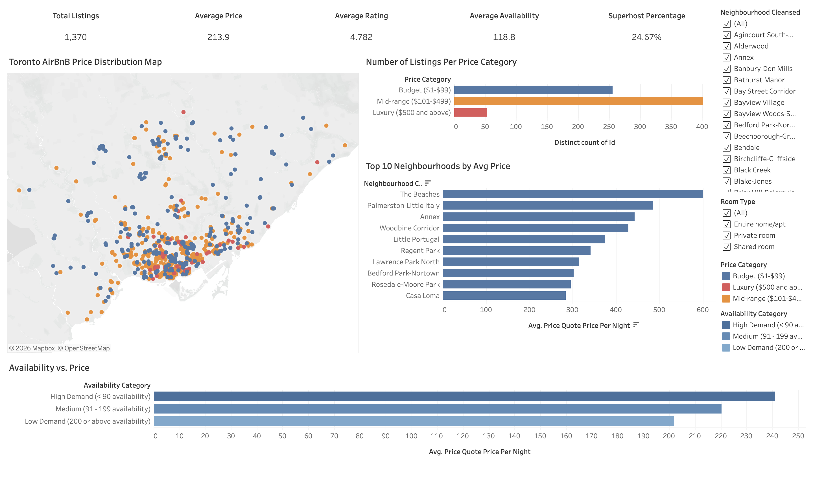

# PorfolioProjects

## Tableau Dashboard

### 1. Toronto Airbnb Market Analysis Dashboard

#### Project Overview

This project analyzes the Toronto Airbnb market using Tableau to uncover trends in listing distribution, pricing, availability, neighborhood performance, and host characteristics.

The objective of this project is to demonstrate end-to-end data analysis skills, including data preparation, transformation, visualization, dashboard design, and business insight generation.

---

#### Tools & Technologies

- Tableau Public
- Python (Pandas)
- Microsoft Excel

---

#### Data Source

This project uses the publicly available Toronto Airbnb dataset (15 June, 2026) from [Inside Airbnb](https://insideairbnb.com/get-the-data/).

Datasets used:
- `reviews.csv`
- `listings.csv`
- `calendar.csv`

---

#### Data Preparation

Before building the dashboard, I used Python (Pandas) to preprocess and organize the data.

Key preparation steps included:

- Consolidated multiple CSV files into a single Excel workbook for easier data exploration.
- Due to Microsoft Excel's row limit (1,048,576 rows per worksheet), large CSV files were imported in manageable chunks during preprocessing using Python (Pandas).
- Cleaned invalid characters and handled formatting issues.
- Removed records with missing or zero prices where appropriate.
- Created calculated fields in Tableau (e.g., Price Category and Demand Category) for visualization and analysis.

---

#### Dashboard Features

##### KPI Summary

- Total Listings
- Average Price
- Average Rating
- Average Availability
- Superhost Percentage

##### Visualizations

###### Exploratory Data Analysis

Before building the dashboard, exploratory analysis was conducted to better understand the distribution of Airbnb listing prices.

A price distribution chart (histogram) was created to examine how listings were distributed across different price ranges. Based on this analysis, custom **Price Categories** were defined to avoid heavily skewing listings toward a single category and to provide more meaningful comparisons in the dashboard.

This data-driven approach resulted in more balanced visualizations and improved interpretability of the pricing analysis.

**price category:**
- Budget: $1 - $99
- Mid-range: $101 - $499
- Luxury: $500 and above

**Toronto Airbnb Price Distribution Map**

Interactive map showing the geographic distribution of Airbnb listings based on price categories.

**Number of Listings Per Price Category**

Displays how listings are distributed across different pricing segments.

**Top 10 Neighborhoods by Average Price**

Highlights the neighborhoods with the highest average Airbnb prices.

**Listings by Demand Category**

Compares the number of listings classified as **High Demand**, **Medium Demand**, and **Low Demand** based on annual availability.

---

#### Business Questions Answered

This dashboard was designed to answer the following business questions:

1. Which Toronto neighborhoods have the highest average Airbnb prices?
2. How are Airbnb listings geographically distributed across the city?
3. How are listings distributed among different price categories?
4. Is there a relationship between listing demand and listing price?
5. What percentage of listings are managed by Superhosts?

---

#### Key Insights

- Higher-priced listings tend to cluster in specific Toronto neighborhoods.
- Most Airbnb listings fall within the mid-price category.
- Lower-priced listings do not necessarily have lower availability.
- Approximately one-quarter of Toronto Airbnb listings are managed by Superhosts.

---

#### Skills Demonstrated

- Data Cleaning
- Data Transformation
- Python (Pandas)
- Tableau Dashboard Development
- Geographic Visualization
- KPI Design
- Calculated Fields
- Data Storytelling
- Business Intelligence

---

#### Dashboard Preview

---

